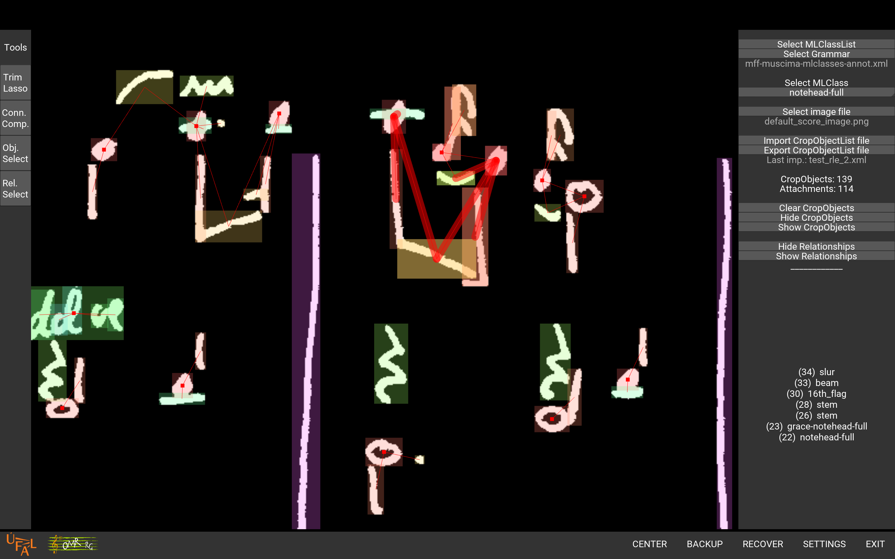

# Optical Music Recognition Datasets

This repository contains a collection of many datasets used for various Optical Music Recognition tasks, including training of Convolutional Neuronal Networks (CNNs), validating existing systems or comparing your system with a known ground-truth.

Note that most datasets have been developed by researcher and using their dataset requires accepting a certain license and/or citing their respective publications, as indicated for each dataset. Most datasets link to the official website, where you can download the dataset.

Coming soon: ~~Finally, there are scripts available, that automatically download the dataset and provide a unified interface for downloading, extracting and handling the different datasets.~~

Datasets inside this repository:

* [Handwritten Online Musical Symbols (HOMUS)](#handwritten-online-musical-symbols-homus)
* [Music Score Classification Dataset](#music-score-classification-dataset)
* [CVC-MUSCIMA](#cvc-muscima)
* [MUSCIMA++](#musicma)
* Audiveris OMR
* Rebelo Dataset
* Gamera Project

# Handwritten Online Musical Symbols (HOMUS)

**Official website**: http://grfia.dlsi.ua.es/homus/
 

**Summary**: The goal of the Handwritten Online Musical Symbols (HOMUS) dataset is to provide a reference corpus with around 15000 samples for research on the recognition of online handwritten music notation. For each sample, the individual strokes that the musicians wrote on a Samsung Tablet using a stylus were recorded and can be used in online and offline scenarios.

**Scientific Publication**: J. Calvo-Zaragoza and J. Oncina, "Recognition of Pen-Based Music Notation: The HOMUS Dataset," 2014 22nd International Conference on Pattern Recognition, Stockholm, 2014, pp. 3038-3043. [DOI: 10.1109/ICPR.2014.524](http://dx.doi.org/10.1109/ICPR.2014.524)

**Example**:

*Remarks*: The original dataset contains around 20 artifacts and misclassifications that were [corrected by Alexander Pacha](https://github.com/apacha/Homus). The corrections are included in version 2.0.

# Music Score Classification Dataset

**Official website**: https://github.com/apacha/MusicScoreClassifier 

**Summary**: A dataset of 2000 images, containing 1000 images of music scores and 1000 images of other objects including text documents. The images were taken with a smartphone camera from various angles and different lighting conditions.

**Example**:

# CVC-MUSCIMA

**Official website**: http://www.cvc.uab.es/cvcmuscima/index_database.html

**Summary**: The CVC-MUSCIMA database contains handwritten music score images, which has been specially designed for writer identification and staff removal tasks. The database contains 1,000 music sheets written by 50 different musicians. All of them are adult musicians, in order to ensure that they have their own characteristic handwriting style. Each writer has transcribed the same 20 music pages, using the same pen and the same kind of music paper (with printed staff lines). The set of the 20 selected music sheets contains music scores for solo instruments and music scores for choir and orchestra.

**Scientific Publication**: Alicia Fornés, Anjan Dutta, Albert Gordo, Josep Lladós. CVC-MUSCIMA: A Ground-truth of Handwritten Music Score Images for Writer Identification and Staff Removal. International Journal on Document Analysis and Recognition, Volume 15, Issue 3, pp 243-251, 2012. [DOI: 10.1007/s10032-011-0168-2](http://dx.doi.org/10.1007/s10032-011-0168-2)

**Example**:

# MUSCIMA++

**Official website**: https://ufal.mff.cuni.cz/muscima

**Summary**: MUSCIMA++ is a dataset of handwritten music notation for musical symbol detection that is based on the MUSCIMA dataset. It contains 91255 symbols, consisting of both notation primitives and higher-level notation objects, such as key signatures or time signatures. There are 23352 notes in the dataset, of which 21356 have a full notehead, 1648 have an empty notehead, and 348 are grace notes. Composite objects, such as notes, are captured through explicitly annotated relationships of the notation primitives (noteheads, stems, beams...). This way, the annotation provides an explicit bridge between the low-level and high-level symbols described in Optical Music Recognition literature.

**Scientific Publication**: Jan Hajič jr., Pavel Pecina. In Search of a Dataset for Handwritten Optical Music Recognition: Introducing MUSCIMA++. CoRR, arXiv:1703.04824, 2017. https://arxiv.org/abs/1703.04824

**Example**:

*Remarks*: Since this dataset is derived from the MUSCIMA dataset, using it requires to reference both works.

# Template for the next dataset

**Official website**: 

**Summary**: 

**Scientific Publication**: 

**Example**: