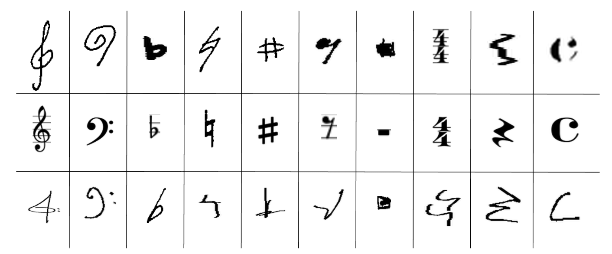
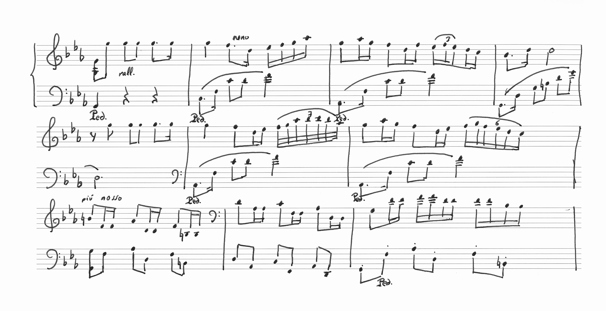
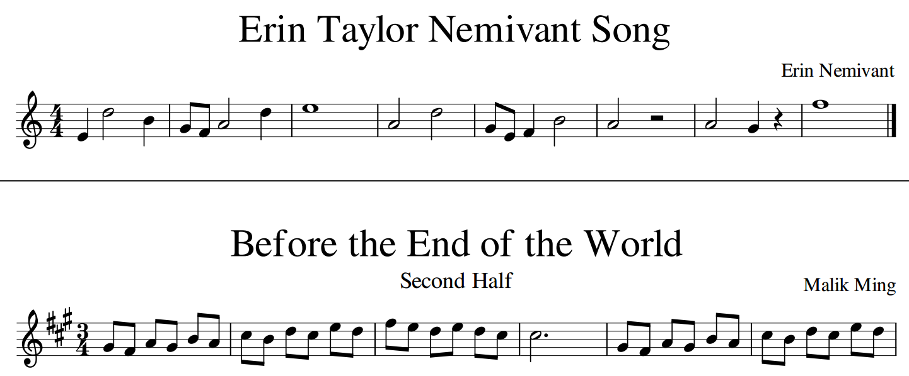
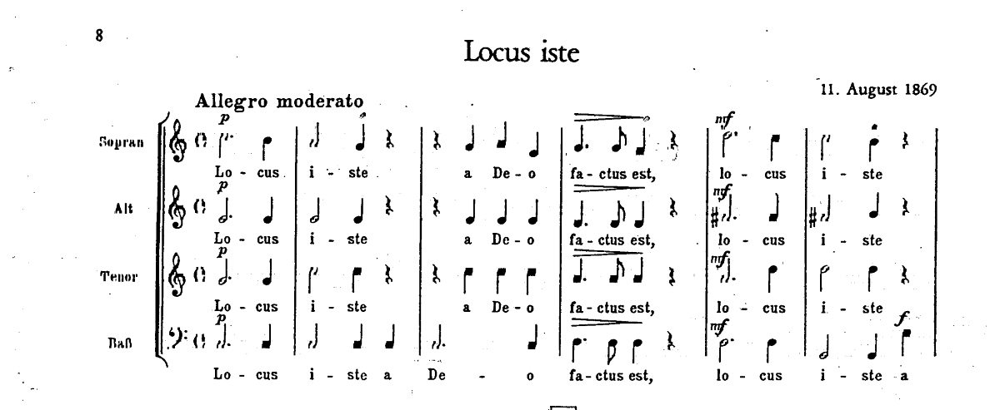
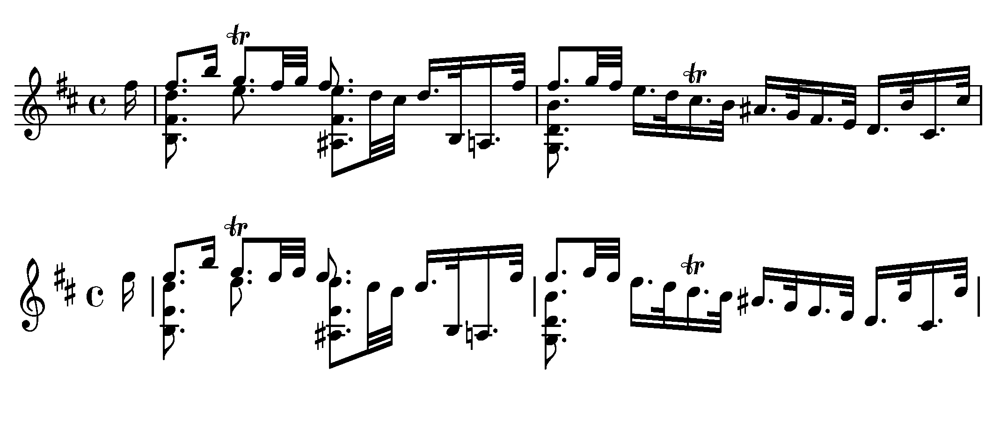
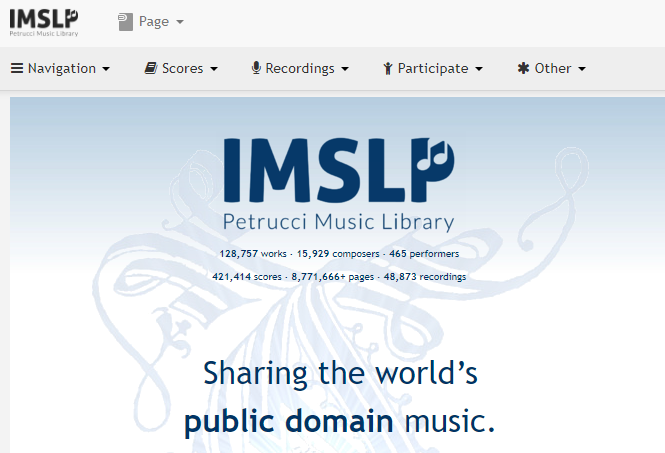

# [Optical Music Recognition Datasets](https://apacha.github.io/OMR-Datasets/)

This repository contains a collection of many datasets used for various Optical Music Recognition tasks, including staff-line detection and removal, training of Convolutional Neuronal Networks (CNNs) or validating existing systems by comparing your system with a known ground-truth.

Note that most datasets have been developed by researchers and using their dataset requires accepting a certain license and/or citing their respective publications, as indicated for each dataset. Most datasets link to the official website, where you can download the dataset.

The following datasets are referenced from this repository:

* [Handwritten Online Musical Symbols (HOMUS)](#handwritten-online-musical-symbols-homus)
* [Music Score Classification Dataset](#music-score-classification-dataset)
* [Universal Music Symbol Collection](#universal-music-symbol-collection)
* [CVC-MUSCIMA](#cvc-muscima)
* [MUSCIMA++](#muscima)
* [MuseScore](#musescore)
* [Capitan collection](#capitan-collection)
* [MuseScore Monophonic MusicXML Dataset](#musescore-monophonic-musicxml-dataset)
* [Rebelo Dataset](#rebelo-dataset)
* [Fornes Dataset](#fornes-dataset)
* [Audiveris OMR](#audiveris-omr)
* [Printed Music Symbols Dataset](#printed-music-symbols-dataset)
* [OpenOMR Dataset](#openomr-dataset)
* [Gamera Project](#gamera-project)
* [IMSLP](#imslp)
* [Byrd Dataset](#byrd-dataset)

## Tools for working with the datasets
      

# Handwritten Online Musical Symbols (HOMUS)

**Official website**: [http://grfia.dlsi.ua.es/homus/](http://grfia.dlsi.ua.es/homus/)
 

**Summary**: The Handwritten Online Musical Symbols (HOMUS) dataset is a reference corpus with around 15000 samples for research on the recognition of online handwritten music notation. For each sample, the individual strokes that the musicians wrote on a Samsung Tablet using a stylus were recorded and can be used in online and offline scenarios.

**Scientific Publication**: J. Calvo-Zaragoza and J. Oncina, "Recognition of Pen-Based Music Notation: The HOMUS Dataset," 2014 22nd International Conference on Pattern Recognition, Stockholm, 2014, pp. 3038-3043. [DOI: 10.1109/ICPR.2014.524](http://dx.doi.org/10.1109/ICPR.2014.524)

**Example**:

*Remarks*: The original dataset contains around 20 artifacts and misclassifications that were reported to the authors and [corrected by Alexander Pacha](https://github.com/apacha/Homus). 

# Music Score Classification Dataset

**Official website**: [https://github.com/apacha/MusicScoreClassifier](https://github.com/apacha/MusicScoreClassifier) 

**Summary**: A dataset of 2000 images, containing 1000 images of music scores and 1000 images of other objects including text documents. The images were taken with a smartphone camera from various angles and different lighting conditions.

**Scientific Publication**: Alexander Pacha, Horst Eidenberger, Towards Self-Learning Optical Music Recognition. 2017 16th IEEE International Conference on Machine Learning and Applications (ICMLA), Cancún, Mexiko, Dezember 2017. [DOI: 10.1109/ICMLA.2017.00-60](http://dx.doi.org/10.1109/ICMLA.2017.00-60)

**Example**:

# Universal Music Symbol Collection

**Official website**: [https://github.com/apacha/MusicSymbolClassifier](https://github.com/apacha/MusicSymbolClassifier), [Slides](https://docs.google.com/presentation/d/14g97TnrcI9o-5D6DIY-dMFfBp9kUAqpbe86c-VE83Bk/edit?usp=sharing) 

**Summary**: A collection of various other datasets, that combines 7 datasets into a large unified dataset of 90000 tiny music symbol images from 79 classes that can be used to train a universal music symbol classifier. 74000 symbols are handwritten and 16000 are printed symbols.

**Scientific Publication**: Alexander Pacha, Horst Eidenberger. Towards a Universal Music Symbol Classifier. Proceedings of the 12th IAPR International Workshop on Graphics Recognition, Kyoto, Japan, November 2017. [DOI: 10.1109/ICDAR.2017.265](http://dx.doi.org/10.1109/ICDAR.2017.265)

**Example**:

# CVC-MUSCIMA

**Official website**: [http://www.cvc.uab.es/cvcmuscima/index_database.html](http://www.cvc.uab.es/cvcmuscima/index_database.html)

**Summary**: The CVC-MUSCIMA database contains handwritten music score images, which has been specially designed for writer identification and staff removal tasks. The database contains 1,000 music sheets written by 50 different musicians. All of them are adult musicians, in order to ensure that they have their own characteristic handwriting style. Each writer has transcribed the same 20 music pages, using the same pen and the same kind of music paper (with printed staff lines). The set of the 20 selected music sheets contains music scores for solo instruments and music scores for choir and orchestra.

**Scientific Publication**: Alicia Fornés, Anjan Dutta, Albert Gordo, Josep Lladós. CVC-MUSCIMA: A Ground-truth of Handwritten Music Score Images for Writer Identification and Staff Removal. International Journal on Document Analysis and Recognition, Volume 15, Issue 3, pp 243-251, 2012. [DOI: 10.1007/s10032-011-0168-2](http://dx.doi.org/10.1007/s10032-011-0168-2)

**Example**:

# MUSCIMA++

**Official website**: [https://ufal.mff.cuni.cz/muscima](https://ufal.mff.cuni.cz/muscima)

**Summary**: MUSCIMA++ is a dataset of handwritten music notation for musical symbol detection that is based on the MUSCIMA dataset. It contains 91255 symbols, consisting of both notation primitives and higher-level notation objects, such as key signatures or time signatures. There are 23352 notes in the dataset, of which 21356 have a full notehead, 1648 have an empty notehead, and 348 are grace notes. Composite objects, such as notes, are captured through explicitly annotated relationships of the notation primitives (noteheads, stems, beams...). This way, the annotation provides an explicit bridge between the low-level and high-level symbols described in Optical Music Recognition literature.

**Scientific Publication**: Jan Hajič jr., Pavel Pecina. The MUSCIMA++ Dataset for Handwritten Optical Music Recognition. 14th International Conference on Document Analysis and Recognition, ICDAR 2017. Kyoto, Japan, November 13-15, pp. 39-46, 2017. [DOI: 10.1109/ICDAR.2017.16](http://dx.doi.org/10.1109/ICDAR.2017.16)

**Example**:

*Remarks*: Since this dataset is derived from the CVC-MUSCIMA dataset, using it requires to reference both works.

# MuseScore

**Official website**: [https://musescore.com/sheetmusic](https://musescore.com/sheetmusic)

**Summary**: [MuseScore](https://musescore.org/) is a free music notation software and also allows their users to upload their sheet music to their website and share it with others. Currently (Jan. 2018) the website hosts over 340000 music sheets, that can be downloaded as MuseScore file (mscz), PDF, MusicXML, MIDI and MP3. 

**Publication**: [https://musescore.org](https://musescore.org)

**Example**:

# Capitan collection

**Official website**: [http://grfia.dlsi.ua.es/](http://grfia.dlsi.ua.es)

 (Freely available for research purposes)

**Summary**: A corpus collected by an electronic pen while tracing isolated music symbols from Early manuscripts. The dataset contains information of both the sequence followed by the pen and the patch of the source under the tracing itself. In total it contains 10230 samples unevenly spread over 30 classes. Each symbol is described as stroke (capitan stroke) and including the piece of score below it (capitan score).

**Scientific Publication**: Jorge Calvo-Zaragoza, David Rizo and Jose M. Iñesta. Two (note) heads are better than one: pen-based multimodal interaction with music scores. International Society of Music Information Retrieval conference, 2016. [Download the PDF](http://grfia.dlsi.ua.es/repositori/grfia/pubs/345/two-note-heads.pdf)

**Example**:

*Remarks*: This dataset exists in two flavours: 

* As raw dataset, which contains only the textual descriptions of the strokes and the images, called *Bimodal music symbols from Early notation*. This format is similar to the HOMUS dataset.
* As rendered images inside of the *Isolated handwritten music symbols* dataset. Also refered to as Capitan collection.

# MuseScore Monophonic MusicXML Dataset

**Official website**: [https://github.com/eelcovdw/mono-musicxml-dataset]()

**Summary**: This dataset contains the IDs to 17000 monophonic scores, that can be downloaded from musescore.com. A sample script is given that downloads one score, given you've obtained a developer key from the MuseScore developers.  

**Scientific Publication**: Eelco van der Wel, Karen Ullrich. Optical Music Recognition with Convolutional Sequence-to-Sequence Models. CoRR, arXiv:1707.04877, 2017. [https://arxiv.org/abs/1707.04877](https://arxiv.org/abs/1707.04877)

**Examples**: 

# Rebelo Dataset

**Official websites**: [http://www.inescporto.pt/~arebelo/index.php](http://www.inescporto.pt/~arebelo/index.php) and [http://www.inescporto.pt/~jsc/projects/OMR/](http://www.inescporto.pt/~jsc/projects/OMR/)

**Summary**: Three datasets of perfect and scanned music symbols including an extensive set of synthetically modified images for staff-line detection and removal.

**Scientific Publication**: A. Rebelo, G. Capela, and J. S. Cardoso, "Optical recognition of music symbols: A comparative study" in International Journal on Document Analysis and Recognition, vol. 13, no. 1, pp. 19-31, 2010. [DOI: 10.1007/s10032-009-0100-1](http://dx.doi.org/10.1007/s10032-009-0100-1)

**Examples**:

*Remarks*: The dataset is usually only available upon request, but with written permission of Ana Rebelo I hereby make the datasets available under a permissive CC-BY-SA license, which allows you to use it freely given you properly mention her work by citing the above mentioned publication: [Download the dataset](https://owncloud.tuwien.ac.at/index.php/s/g3q0COsfPqbDUAW).

# Fornes Dataset
**Official website**: [http://www.cvc.uab.es/~afornes/](http://www.cvc.uab.es/~afornes/)

**Summary**: A dataset of 4100 black and white symbols of 7 different symbol classes: flat, natural, sharp, double-sharp, c-clef, g-clef, f-clef. 

**Scientific Publication**: A.Fornés and J.Lladós and G. Sanchez, "Old Handwritten Musical Symbol Classification by a Dynamic Time Warping Based Method", in Graphics Recognition: Recent Advances and New Opportunities. Liu, W. and Lladós, J. and Ogier, J.M. editors, Lecture Notes in Computer Science, Volume 5046, Pages 51-60, Springer-Verlag Berlin, Heidelberg, 2008. [DOI: 10.1007/978-3-540-88188-9_6
](http://dx.doi.org/10.1007/978-3-540-88188-9_6)

**Example**:

# Audiveris OMR

**Official website**: [https://github.com/Audiveris/omr-dataset-tools](https://github.com/Audiveris/omr-dataset-tools)

**Summary**: A collection of four music sheets with approximately 800 annotated music symbols. The [DeepScore project](https://www.zhaw.ch/no_cache/en/research/people-publications-projects/detail-view-project/projekt/2895/) in cooperation with the ZHAW targets towards [automatically generating these images](https://github.com/Audiveris/omr-dataset-tools/wiki/Synthetic-Images) and the annotations from MuseScore or Lilypond documents. 

**Example**:

# Printed Music Symbols Dataset

**Official website**: [https://github.com/apacha/PrintedMusicSymbolsDataset](https://github.com/apacha/PrintedMusicSymbolsDataset)

**Summary**: A small dataset of about 200 printed music symbols out of 36 different classes. Partially with their context (staff-lines, other symbols) and partially isolated.

**Example**: 

# OpenOMR Dataset

**Official website**: [http://sourceforge.net/projects/openomr/](http://sourceforge.net/projects/openomr/)

**Summary**: A dataset of 706 symbols (g-clef, f-clef) and symbol primitives (note-heads, stems with flags, beams) of 16 classes created by Arnaud F. Desaedeleer as part of his master thesis to train artificial neural networks. 

**Scientific Publication**: Arnaud F. Desaedeleer, "Reading Sheet Music", Master Thesis, University of London, September 2006, [Download](http://sourceforge.net/projects/openomr/)

**Example**:

# Gamera MusicStaves Toolkit

**Official website**: [http://music-staves.sf.net/ and https://github.com/hsnr-gamera](http://music-staves.sf.net/ and https://github.com/hsnr-gamera)

**Summary**: The Synthetic Score Database by Christoph Dalitz that contains 32 scores that have been computer generated with different music typesetting programs. It contains ground truth data and is suitable for the deformations implemented in the toolkit.

**Scientific Publication**: C. Dalitz, M. Droettboom, B. Pranzas, I. Fujinaga: A Comparative Study of Staff Removal Algorithms. IEEE Transactions on Pattern Analysis and Machine Intelligence, vol. 30, no. 5, pp. 753-766 (2008) [DOI: 10.1109/TPAMI.2007.70749](http://dx.doi.org/10.1109/TPAMI.2007.70749)

**Example**:

# IMSLP

**Official website**: [http://imslp.org](http://imslp.org)

**Summary**: The Petrucci Music Library is the largest collection of public domain music, with over 420000 (Jan. 2018) freely available PDF scores by almost 16000 composers accompanied by almost 50000 recordings. It also maintains an extensive list of [other music score websites](http://imslp.org/wiki/IMSLP:Other_music_score_websites), where you can find many more music sheets, e.g. collected during research projects by universities.

**Example**:

# Byrd Dataset

**Official website**: [http://www.diku.dk/hjemmesider/ansatte/simonsen/suppmat/jnmr/](http://www.diku.dk/hjemmesider/ansatte/simonsen/suppmat/jnmr/)

 (Authors want to be contacted)

**Summary**: A small dataset of 34 high quality images with individual music score pages of increasing difficulty. 

**Scientific Publication**: Donald Byrd & Jakob Grue Simonsen: "Towards a Standard Testbed for Optical Music Recognition: Definitions, Metrics, and Page Images". Journal of New Music Research, vol 44, nr.3, pages 169-195, 2015. [DOI: 10.1080/09298215.2015.1045424](http://dx.doi.org/10.1080/09298215.2015.1045424)

**Example**:

